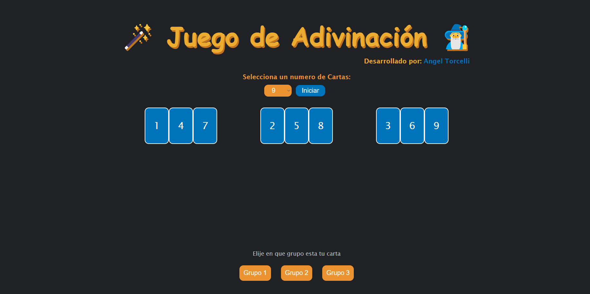

# Cards Trick (Guess a card) with JS

Developed by Angel Torcelli

## Description
This game is a magic trick where the computer guesses the card you chose mentally. You only need to indicate if the card is in the selected deck or not. The computer will repeat some times the question until it guesses the card you chose. 

♣️♥️ Try it: https://angeltorcelli.github.io/cards-magic-trick-js/

